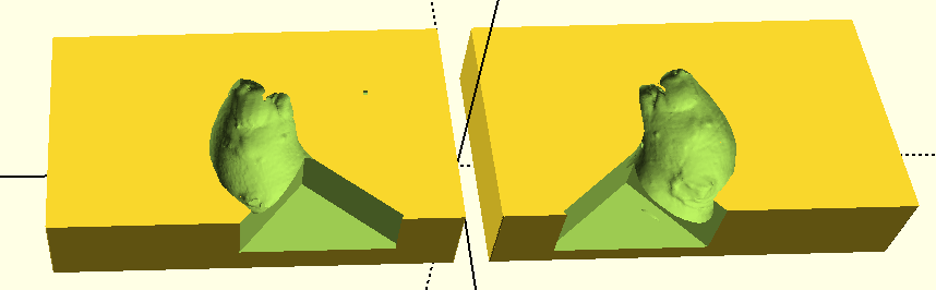

# head_mold
Project Description: Pipeline to generate 3D printed head molds for stereotaxic injections

Dependencies: OpenSCAD 2019.05

## How to Use `mold_generator.scad`:
1. Place the `.stl` file of interest in the same folder as the `.scad` script
2. In line 22, store the file name in the parameter `model_filename`. Note: The software will start to run slower depending on the size of the ".stl" file
3. Change the parameters `model_rotate` (line 23) and possibly `model_translate` (line 25) such that the mouse head points upward and the body lies on the triangle's surface. It should resemble the following image:

4. Render and save the resulting file for printing
